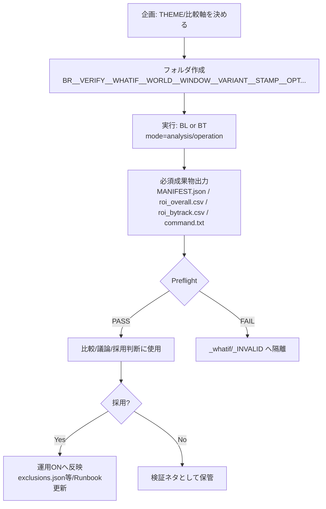

# 準備パート Runbook（正本）
## ゴール
- 全場横断で長期ROI最大化（実践は1日5〜15R程度）

## ゴール
- 全場横断で長期ROI最大化（実践は1日5〜15R程度）

## まず最初に：90Dの「型」を選ぶ（世界線ズレ防止）
このRunbook内で「90D」と言うとき、**どちらの型で作るかを先に固定**する。

- [ ] **C型（運用再現 / C_OUT積み上げ）**：運用の意思決定（S/A判定→除外→CAP10→買い目/金額）をそのまま再現して90D化する  
  - CAP10：⭕（運用制約として適用）  
  - 場除外：⭕（運用用除外として適用）  
  - 目的：**実運用をそのまま90日分にしてROIを見る**
- [ ] **再計算型（分析用 / S相当の性能評価）**：90D分を再計算して conf≥0.87（S相当）の集合で性能を評価する（S/Aラベルは作らない）  
  - CAP10：❌（原則適用しない）  
  - 場除外：❌（原則適用しない。入れるなら“別軸の比較”として明示）  
  - 目的：**モデル構造の性能（ROI/安定性）を見る**

> 重要：**再計算型に運用制約（CAP10・場除外）を混ぜると、性能評価と制約による件数減が混ざり、解釈不能になりやすい。**


## 作業フォルダ
- WORK_DIR: C:\work\boatrace
- RUN_DIR : C:\work\boatrace\runs
- B_DIR   : C:\work\boatrace\b_files
- all_k   : C:\work\boatrace\all_k_results.csv（Kマージ結果の正本）

## 90Dデータ作成（analysis=BL / operation=BT）

> **重要：analysis（BL）には運用制約（CAP/除外）を載せない。CAP/除外は operation（BT）だけ。**

### 0) 前提入力（この90Dの“外側”）
- features_csv: `runs\official_features_alltracks_YYYY-MM-DD_YYYY-MM-DD_dedup.csv`
- payouts_csv:  `runs\payouts_all_YYYY-MM-DD_YYYY-MM-DD_*.csv`（例：`..._MERGED_keynorm_90d.csv`）
- date-from / date-to: **YYYY-MM-DD**

---

### 1) baseline（analysis / BL出力：性能評価・制約なし）

```powershell
cd C:\work\boatrace

python .\boatrace_backtest_v12_prune_configurable_s087_alltracks.py `
  --mode analysis `
  --features-csv .\runs\official_features_alltracks_2025-10-02_2026-01-10_dedup.csv `
  --payouts-csv  .\runs\payouts_all_2025-10-02_2026-01-10_MERGED_keynorm_90d.csv `
  --date-from 2025-10-02 `
  --date-to   2026-01-10
```

出力（例）：
- `runs\BL_2025-10-02_2026-01-10_report.csv`
- `runs\BL_2025-10-02_2026-01-10_tickets_long.csv`
- `runs\BL_2025-10-02_2026-01-10_summary.txt` ほか

---

### 2) operation（operation / BT出力：運用再現・CAP10のみ）

```powershell
cd C:\work\boatrace

python .\boatrace_backtest_v12_prune_configurable_s087_alltracks.py `
  --mode operation `
  --features-csv .\runs\official_features_alltracks_2025-10-02_2026-01-10_dedup.csv `
  --payouts-csv  .\runs\payouts_all_2025-10-02_2026-01-10_MERGED_keynorm_90d.csv `
  --date-from 2025-10-02 `
  --date-to   2026-01-10 `
  --daily-cap 10 `
  --daily-cap-priority conf
```

---

### 3) operation（operation / BT出力：運用再現・CAP10 + 除外）

> `--exclude-jcd` は **jcdを空白区切りで列挙**（PowerShellで `<...>` を書くと構文エラーになります）
>
> 例：`--exclude-jcd 14 22 24`（TRACK_EXCLUSIONS.md の jcd列をそのまま並べる）

```powershell
cd C:\work\boatrace

python .\boatrace_backtest_v12_prune_configurable_s087_alltracks.py `
  --mode operation `
  --features-csv .\runs\official_features_alltracks_2025-10-02_2026-01-10_dedup.csv `
  --payouts-csv  .\runs\payouts_all_2025-10-02_2026-01-10_MERGED_keynorm_90d.csv `
  --date-from 2025-10-02 `
  --date-to   2026-01-10 `
  --daily-cap 10 `
  --daily-cap-priority conf `
  --exclude-jcd 14 22 24
```

出力（例）：
- `runs\BT_2025-10-02_2026-01-10_report.csv`
- `runs\BT_2025-10-02_2026-01-10_tickets_long.csv`
- `runs\BT_2025-10-02_2026-01-10_summary.txt` ほか

---

### よくあるミス
- `--mode analysis` に `--daily-cap` / `--exclude-jcd` を付ける → **ERR（禁止）**
- date を `YYYYMMDD` で渡す → データ0件になりやすい（※改善タスクとして自動変換を台帳に登録済み）


## 準備フロー（基本）
1) Bファイル準備（Downloads→b_files）
   - python .\prepare_b_files_v2.py --src "%USERPROFILE%\Downloads" --dst "C:\work\boatrace\b_files" --sevenzip "C:\Program Files\7-Zip\7z.exe"
   - python .\infer_dates_from_bfiles.py --b-dir "C:\work\boatrace\b_files" --mode plain
2) Kファイル取得（期間指定）→マージ（重要：詰まりポイント対策）
   - 正本のK格納先（input-dir）は **k_filesではなく** 下記を使用する：
     - K_DIR : C:\work\boatrace\mbrace_k_results
     ※環境によって `C:\work\boatrace\k_files` が存在しない／別用途になっており、ここで毎回詰まりやすい。
   - K取得（YYYYMMDD形式）
     - python .\download_mbrace_k.py --date-from YYYYMMDD --date-to YYYYMMDD --out-dir "C:\work\boatrace\mbrace_k_results"
   - Kマージ（all_k_results.csv を正本として生成）
     - python .\merge_k_results.py --input-dir "C:\work\boatrace\mbrace_k_results" --output "C:\work\boatrace\all_k_results.csv" --date-from YYYYMMDD --date-to YYYYMMDD
   - 完了判定（空出力を即検知）
     - PowerShell:
       ```powershell
       cd C:\work\boatrace
       $k = Import-Csv .\all_k_results.csv
       if(($k | Measure-Object).Count -eq 0){ throw "all_k_results.csv が空です（K_DIRや期間を再確認）" }
       ($k | Select-Object -ExpandProperty date | Sort-Object -Unique).Count
       $k | Sort-Object date | Select-Object -First 1
       $k | Sort-Object date | Select-Object -Last 1
       ```
   - （任意）互換：古い手順が `k_files` を前提にしている場合
     - 管理者権限が無い環境では symlink は失敗しがちなので、**リンクで吸収せず**、上記の通り `--input-dir` を明示する運用を正とする。
3) payout取得（最優先・resume）
   - python .\collect_boatrace_payouts_v2.py --all-k-csv "C:\work\boatrace\all_k_results.csv" --date-from YYYY-MM-DD --date-to YYYY-MM-DD --output "C:\work\boatrace\runs\payouts_all_YYYY-MM-DD_YYYY-MM-DD.csv" --resume --checkpoint-every 25
4) official features作成 → dedup
   - python .\collect_boatrace_official_features_bonly_v2.py --b-dir "C:\work\boatrace\b_files" --date-from YYYY-MM-DD --date-to YYYY-MM-DD --output "C:\work\boatrace\runs\official_features_alltracks_YYYY-MM-DD_YYYY-MM-DD.csv" --b-only
   - python .\dedup_official_features.py --input "C:\work\boatrace\runs\official_features_alltracks_YYYY-MM-DD_YYYY-MM-DD.csv" --output "C:\work\boatrace\runs\official_features_alltracks_YYYY-MM-DD_YYYY-MM-DD_dedup.csv"
5) preflight（欠損チェック）
   - python .\preflight_boatrace_inputs_v2.py --features "...\_dedup.csv" --payouts "...\payouts_all_....csv" --out-issues "C:\work\boatrace\runs\preflight_issues_....csv" --max-missing-payout-rate 0.20
6) backtest（該当スクリプトで実行）

## 注意（事故防止）
- payout二重起動を避ける（ロック/skip設計が必要）
- K/Bの揃う共通期間に寄せる
- dedupは必須

## Payout運用（原則：既存再利用 / 例外：差分DLのみ）
- payoutは取得に時間がかかるため、検証・GUARD確認では **既存のMERGED_keynorm等を優先して使用**する。
- 期間拡張（例：ticketsを90dへ）でpayoutが不足する場合：
  1) 既存payoutの保有日付を確認して不足日を特定（dry-run）
  2) 不足日レンジのみ差分DL（必要時だけ実行）
  3) deltaを既存にマージしてdedupし、以後はマージ済みを正本として再利用
- 重要：GUARD確認が目的の局面では、payout差分DLは**必要になってから**（＝原則後回し）。

## 追加：固定窓ROI比較（candidate vs baseline）
目的：ticketsの生成期間（例: 90d）が伸びても、評価窓を固定して比較する（世界線ズレ防止）。

- 例（窓固定）：2025-10-08..2025-12-30
- payoutsは同一ファイルを使う（例：payouts_all_2025-10-02_2025-12-30_MERGED_keynorm.csv）
- candidate は「窓でフィルタした tickets」に対して CAP10+EXCL を適用してから ROI を計算する。

## 追加：payouts差分DL（CLI引数が必須）
payouts_diff_update.py は --existing / --date-from / --date-to / --collector / --all-k-csv / --output-dir / --merged-out が必須。
（例：既存 2025-10-02..2025-12-30 を 2026-01-05 まで延長）


### payout取得のPreflight（argparse/空出力を未然に防ぐ）
PowerShell:
```powershell
# 1) all_k の解決（最新を拾う）
$ALLK = (Get-ChildItem -Recurse -File -Filter "all_k_results*.csv" |
  Sort-Object LastWriteTime -Descending |
  Select-Object -First 1).FullName

if([string]::IsNullOrWhiteSpace($ALLK) -or !(Test-Path $ALLK)){
  throw "all_k_results*.csv が見つかりません。先にK取得→マージを実施してください。"
}
"ALLK=" + $ALLK

# 2) 期間が足りているか（まずはファイル名から簡易判定）
#    例: all_k_results_20260102_20260105.csv の末尾日=2026-01-05
if($ALLK -match '_(\d{8})\.csv$'){
  $end = [datetime]::ParseExact($Matches[1],'yyyyMMdd',$null)
  $need_to = Get-Date "2026-01-06"
  if($end -lt $need_to){ throw "all_k の末尾日($end)が必要日($need_to)に届いていません。all_k を延長してください。" }
}

# 3) 出力が空なら即停止（BOM+改行だけを弾く）
function Assert-NotEmptyCsv([string]$path){
  if(!(Test-Path $path)){ throw "出力が存在しません: $path" }
  if((Get-Item $path).Length -lt 100){ throw "出力が空です（0件/失敗の可能性）: $path" }
}
```

## 追加：source_of_truth（固定化）
- baseline: `C:\work\boatrace\config\baseline.json`
- exclusions（運用ON）: `C:\work\boatrace\config\exclusions.json`
- candidate（CAP10+EXCL deterministic v2）: `C:\work\boatrace\config\candidate_cap10_excl10.json`

## 作業フォルダ
- WORK_DIR: C:\work\boatrace
- RUN_DIR : C:\work\boatrace\runs
- B_DIR   : C:\work\boatrace\b_files
- all_k   : C:\work\boatrace\all_k_results.csv（Kマージ結果の正本）

## 準備フロー（基本）
1) Bファイル準備（Downloads→b_files）
   - python .\prepare_b_files_v2.py --src "%USERPROFILE%\Downloads" --dst "C:\work\boatrace\b_files" --sevenzip "C:\Program Files\7-Zip\7z.exe"
   - python .\infer_dates_from_bfiles.py --b-dir "C:\work\boatrace\b_files" --mode plain
2) Kファイル取得（期間指定）→マージ（重要：詰まりポイント対策）
   - 正本のK格納先（input-dir）は **k_filesではなく** 下記を使用する：
     - K_DIR : C:\work\boatrace\mbrace_k_results
     ※環境によって `C:\work\boatrace\k_files` が存在しない／別用途になっており、ここで毎回詰まりやすい。
   - K取得（YYYYMMDD形式）
     - python .\download_mbrace_k.py --date-from YYYYMMDD --date-to YYYYMMDD --out-dir "C:\work\boatrace\mbrace_k_results"
   - Kマージ（all_k_results.csv を正本として生成）
     - python .\merge_k_results.py --input-dir "C:\work\boatrace\mbrace_k_results" --output "C:\work\boatrace\all_k_results.csv" --date-from YYYYMMDD --date-to YYYYMMDD
   - 完了判定（空出力を即検知）
     - PowerShell:
       ```powershell
       cd C:\work\boatrace
       $k = Import-Csv .\all_k_results.csv
       if(($k | Measure-Object).Count -eq 0){ throw "all_k_results.csv が空です（K_DIRや期間を再確認）" }
       ($k | Select-Object -ExpandProperty date | Sort-Object -Unique).Count
       $k | Sort-Object date | Select-Object -First 1
       $k | Sort-Object date | Select-Object -Last 1
       ```
   - （任意）互換：古い手順が `k_files` を前提にしている場合
     - 管理者権限が無い環境では symlink は失敗しがちなので、**リンクで吸収せず**、上記の通り `--input-dir` を明示する運用を正とする。
3) payout取得（最優先・resume）
   - python .\collect_boatrace_payouts_v2.py --all-k-csv "C:\work\boatrace\all_k_results.csv" --date-from YYYY-MM-DD --date-to YYYY-MM-DD --output "C:\work\boatrace\runs\payouts_all_YYYY-MM-DD_YYYY-MM-DD.csv" --resume --checkpoint-every 25
4) official features作成 → dedup
   - python .\collect_boatrace_official_features_bonly_v2.py --b-dir "C:\work\boatrace\b_files" --date-from YYYY-MM-DD --date-to YYYY-MM-DD --output "C:\work\boatrace\runs\official_features_alltracks_YYYY-MM-DD_YYYY-MM-DD.csv" --b-only
   - python .\dedup_official_features.py --input "C:\work\boatrace\runs\official_features_alltracks_YYYY-MM-DD_YYYY-MM-DD.csv" --output "C:\work\boatrace\runs\official_features_alltracks_YYYY-MM-DD_YYYY-MM-DD_dedup.csv"
5) preflight（欠損チェック）
   - python .\preflight_boatrace_inputs_v2.py --features "...\_dedup.csv" --payouts "...\payouts_all_....csv" --out-issues "C:\work\boatrace\runs\preflight_issues_....csv" --max-missing-payout-rate 0.20
6) backtest（該当スクリプトで実行）

## 注意（事故防止）
- payout二重起動を避ける（ロック/skip設計が必要）
- K/Bの揃う共通期間に寄せる
- dedupは必須

## Payout運用（原則：既存再利用 / 例外：差分DLのみ）
- payoutは取得に時間がかかるため、検証・GUARD確認では **既存のMERGED_keynorm等を優先して使用**する。
- 期間拡張（例：ticketsを90dへ）でpayoutが不足する場合：
  1) 既存payoutの保有日付を確認して不足日を特定（dry-run）
  2) 不足日レンジのみ差分DL（必要時だけ実行）
  3) deltaを既存にマージしてdedupし、以後はマージ済みを正本として再利用
- 重要：GUARD確認が目的の局面では、payout差分DLは**必要になってから**（＝原則後回し）。

## 追加：固定窓ROI比較（candidate vs baseline）
目的：ticketsの生成期間（例: 90d）が伸びても、評価窓を固定して比較する（世界線ズレ防止）。

- 例（窓固定）：2025-10-08..2025-12-30
- payoutsは同一ファイルを使う（例：payouts_all_2025-10-02_2025-12-30_MERGED_keynorm.csv）
- candidate は「窓でフィルタした tickets」に対して CAP10+EXCL を適用してから ROI を計算する。

## 追加：payouts差分DL（CLI引数が必須）
payouts_diff_update.py は --existing / --date-from / --date-to / --collector / --all-k-csv / --output-dir / --merged-out が必須。
（例：既存 2025-10-02..2025-12-30 を 2026-01-05 まで延長）


### payout取得のPreflight（argparse/空出力を未然に防ぐ）
PowerShell:
```powershell
# 1) all_k の解決（最新を拾う）
$ALLK = (Get-ChildItem -Recurse -File -Filter "all_k_results*.csv" |
  Sort-Object LastWriteTime -Descending |
  Select-Object -First 1).FullName

if([string]::IsNullOrWhiteSpace($ALLK) -or !(Test-Path $ALLK)){
  throw "all_k_results*.csv が見つかりません。先にK取得→マージを実施してください。"
}
"ALLK=" + $ALLK

# 2) 期間が足りているか（まずはファイル名から簡易判定）
#    例: all_k_results_20260102_20260105.csv の末尾日=2026-01-05
if($ALLK -match '_(\d{8})\.csv$'){
  $end = [datetime]::ParseExact($Matches[1],'yyyyMMdd',$null)
  $need_to = Get-Date "2026-01-06"
  if($end -lt $need_to){ throw "all_k の末尾日($end)が必要日($need_to)に届いていません。all_k を延長してください。" }
}

# 3) 出力が空なら即停止（BOM+改行だけを弾く）
function Assert-NotEmptyCsv([string]$path){
  if(!(Test-Path $path)){ throw "出力が存在しません: $path" }
  if((Get-Item $path).Length -lt 100){ throw "出力が空です（0件/失敗の可能性）: $path" }
}
```

## 追加：source_of_truth（固定化）
- baseline: `C:\work\boatrace\config\baseline.json`
- exclusions（運用ON）: `C:\work\boatrace\config\exclusions.json`
- candidate（CAP10+EXCL deterministic v2）: `C:\work\boatrace\config\candidate_cap10_excl10.json`

## スモークテスト（確認メモ）
- 2026-01-12：analysis→BL_*, operation→BT_* が runs/ に出力されることを最小レンジ（2026-01-02〜2026-01-04）で確認済み。

---

## Preflight チェックリスト（90D / what-if 用）

**目的**  
- 実行・比較・採用に進んでよい成果物かを、**実行前に**機械的に判定する。
- BL/BT の世界線混在、制約混入、証拠不足を入口で止める。

### 対象
- `_whatif/` 配下の成果物フォルダ（90D検証）

### チェック項目（PASS / FAIL）

**1. フォルダ名（命名規約）**
- WORLD（BL/BT）が含まれている
- WINDOW が `YYYY-MM-DD_YYYY-MM-DD`
- VARIANT が含まれている  
→ 1つでも欠けたら **FAIL**

**2. 必須ファイル**
- `MANIFEST.json`
- `roi_overall.csv`
- `roi_bytrack.csv`
- `command.txt`
- （WORLD=BT の場合）`tickets_long.csv`  
→ 欠損があれば **FAIL**

**3. MANIFEST 整合**
- `manifest.world` と フォルダ名の WORLD が一致
- `manifest.window.from/to` と WINDOW が一致
- WORLD=BL の場合：`daily_cap` / `exclude_jcd` が **null**
- WORLD=BT の場合：制約（CAP/EXCL）が **明示**されている（none 含む）  
→ 不一致は **FAIL**

### 判定
- **PASS**：比較・議論・採用判断に使用可
- **FAIL**：採用判断に使用不可（理由を記録）

### 運用ルール（固定）
- preflight **PASS のみ**を比較・採用判断に使用する。
- FAIL の成果物は `_whatif/_INVALID/` 等に隔離して再利用しない。


---

## Preflight 自動化（簡易：チェックのみ）

### 目的
- 90D / what-if フォルダを走査し、preflight PASS/FAIL と理由をCSV出力する（**比較に進めるものだけを残す**）。

### 生成物
- `runs\preflight_whatif_report.csv`（PASS/FAIL と理由）
- `runs\preflight_whatif_report_summary.txt`（集計）

### スクリプト
- Python：`tools\preflight_check_whatif.py`
- PowerShell：`tools\preflight_check_whatif.ps1`（pythonラッパー）

### 実行例（PowerShell）
```powershell
# これはあなたの作業です
cd C:\work\boatrace
powershell -ExecutionPolicy Bypass -File .\tools\preflight_check_whatif.ps1 `
  -WhatIfRoot ".\_whatif" `
  -OutCsv ".\runs\preflight_whatif_report.csv"
```

### 判定ルール（固定）
- report で `status=PASS` のみを比較・採用判断に使用する。
- FAIL は `_whatif\_INVALID\` などへ隔離（人間の記憶に頼らない）。


---

## Preflight チェックリスト（Cフェーズ用：最小）

**目的**  
- Cフェーズの成果物（C_OUT / diagnostic / tickets）を「その日の運用に使えるか」実行前に判定する。
- 古いC_OUT流用、入力セット不一致、世界線混在（BL/BT）を防止する。

### 対象
- Cフェーズの出力フォルダ（例：`runs\C_OUT_YYYY-MM-DD_*`）および当日使用する入力セット。

### チェック項目（PASS / FAIL）

**1. 日付整合**
- 予測日（TARGET_DATE）と C_OUT の日付が一致（同日であること）
- 締切15分前運用のため、当日生成であること（STAMPが当日）

**2. WORLD（必須）**
- C_OUT / manifest / runログに WORLD が明示されている（通常は BT）
- WORLD=BL の出力は「参考比較」扱いで、運用採用判断には使用しない

**3. 入力セット整合（source of truth）**
- `all_k_results.csv` の更新範囲が当日ルールに一致
- `official_features_all_*` が dedup 済み
- `fan` ファイルの期が意図どおり

**4. 制約整合（運用）**
- 運用ONの daily cap / excluded_jcd（core5等）が出力に明示されている
- 出力に `exclude_jcd` が書かれている（none含む）

### 判定
- **PASS**：当日の運用（C→D）に使用可
- **FAIL**：当日運用に使用不可（理由を記録し再生成へ）


---

## 90D / what-if 運用フロー（図）



補足：
- **PASSのみ**を比較・採用判断に使用（FAILは隔離）。
- BLは性能評価、BTは運用再現。混ぜない。

